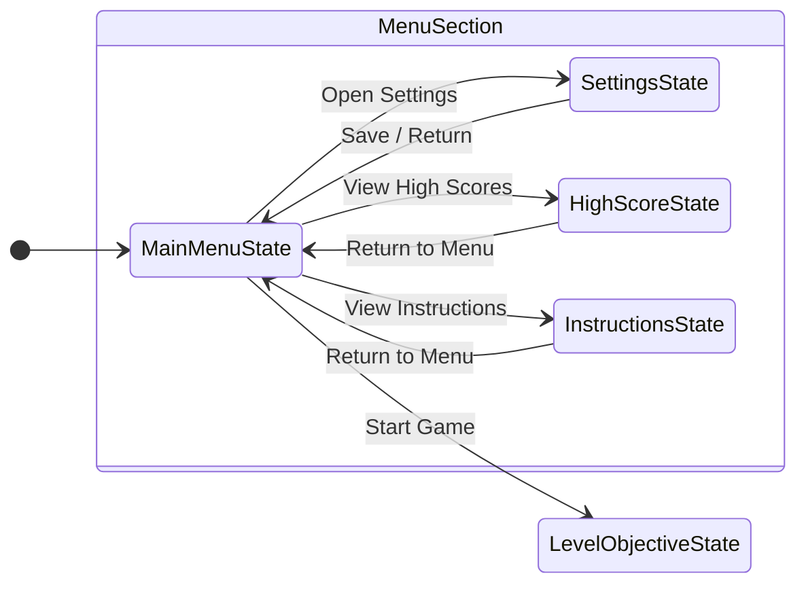

# Main Menu State

The `MainMenuState` class represents the primary entry point interface when launching the Alien Attack project. Inheriting from the base [GameState](game.md) class, it manages the layout, user interactions, and menu buttons that allow the player to navigate through the game options.

## Core Components

* [MainMenuState.h](https://github.com/joeaoregan/LIT-Yr3-AdvancedDigitalGameProgramming/blob/master/1-AlienAttack/Alien%20Attack%20K00203642/MainMenuState.h) & [MainMenuState.cpp](https://github.com/joeaoregan/LIT-Yr3-AdvancedDigitalGameProgramming/blob/master/1-AlienAttack/Alien%20Attack%20K00203642/MainMenuState.cpp): The concrete implementation files that define the appearance and behaviour of the main menu interface.

## Key Responsibilities

* **Menu Button Management**: Instantiates and tracks interactive `MenuButton` objects that respond to cursor movement and mouse clicks via the [InputHandler](../architecture/input-handler.md).
* **State Transitions**: Translates button selections into actions executed by the [GameStateMachine](../architecture/state-machine.md), allowing players to start gameplay, adjust options, or exit the application.
* **Lifecycle Handling**: Executes `onEnter()` to load menu graphics and configure callbacks, and `onExit()` to clear out assets when transitioning away from the menu.

## Related States

* [Play State](play.md)
* [Settings State](settings.md)
* [Pause State](pause.md)
* [Game Over State](game-over.md)