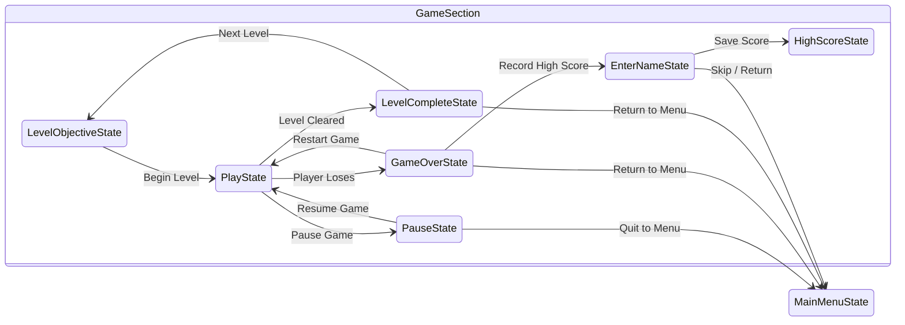

# Play State

The `PlayState` class represents the primary gameplay state within the Alien Attack project. Inheriting from the base [GameState](game.md) class, it manages the active game loop, rendering levels, updating active entities, and processing core game mechanics.

## Core Components

* [PlayState.h](https://github.com/joeaoregan/LIT-Yr3-AdvancedDigitalGameProgramming/blob/master/1-AlienAttack/Alien%20Attack%20K00203642/PlayState.h) & [PlayState.cpp](https://github.com/joeaoregan/LIT-Yr3-AdvancedDigitalGameProgramming/blob/master/1-AlienAttack/Alien%20Attack%20K00203642/PlayState.cpp): The concrete implementation files that define the logic and operations executed during active player sessions.

## Key Responsibilities

* **Level and Entity Management**: Coordinates the loading and updating of active levels using the [Level](../architecture/level-parser.md) structure, handling the player character, enemies, and projectiles.
* **Collision Detection**: Utilizes the [CollisionManager](../architecture/collision-manager.md) during each frame update to verify intersections between player attacks, enemies, environment geometry, and hazards.
* **State Transitions**: Monitors win or loss conditions to seamlessly trigger transitions through the [GameStateMachine](../architecture/state-machine.md) to alternative states like the [Pause State](pause.md) or [Game Over State](game-over.md).

## Related States

* [Main Menu State](main-menu.md)
* [Pause State](pause.md)
* [Game Over State](game-over.md)
* [Level Complete State](level-complete.md)